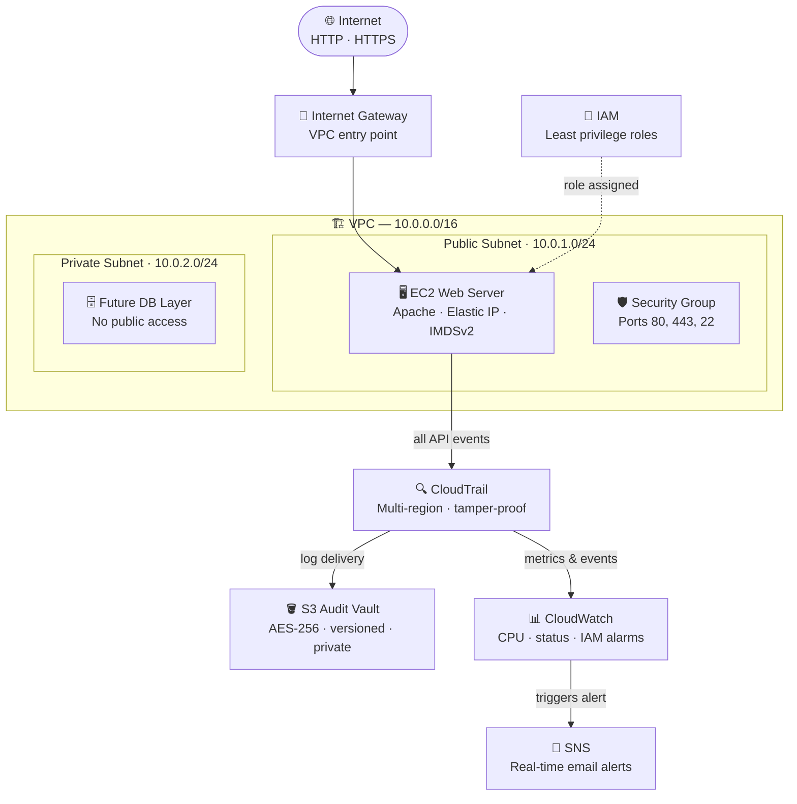

# Architecture Diagram

```mermaid
flowchart TD
    A([🌐 Internet\nHTTP · HTTPS]) --> B[🚪 Internet Gateway\nVPC entry point]
    B --> C

    subgraph VPC["🏗️ VPC — 10.0.0.0/16"]
        subgraph PUB["Public Subnet · 10.0.1.0/24"]
            C[🖥️ EC2 Web Server\nApache · Elastic IP · IMDSv2]
            SG[🛡️ Security Group\nPorts 80, 443, 22]
        end
        subgraph PRI["Private Subnet · 10.0.2.0/24"]
            D[🗄️ Future DB Layer\nNo public access]
        end
    end

    E[🔐 IAM\nLeast privilege roles] -.->|role assigned| C
    C -->|all API events| F[🔍 CloudTrail\nMulti-region · tamper-proof]
    F -->|log delivery| G[🪣 S3 Audit Vault\nAES-256 · versioned · private]
    F -->|metrics & events| H[📊 CloudWatch\nCPU · status · IAM alarms]
    H -->|triggers alert| I[📧 SNS\nReal-time email alerts]
```
