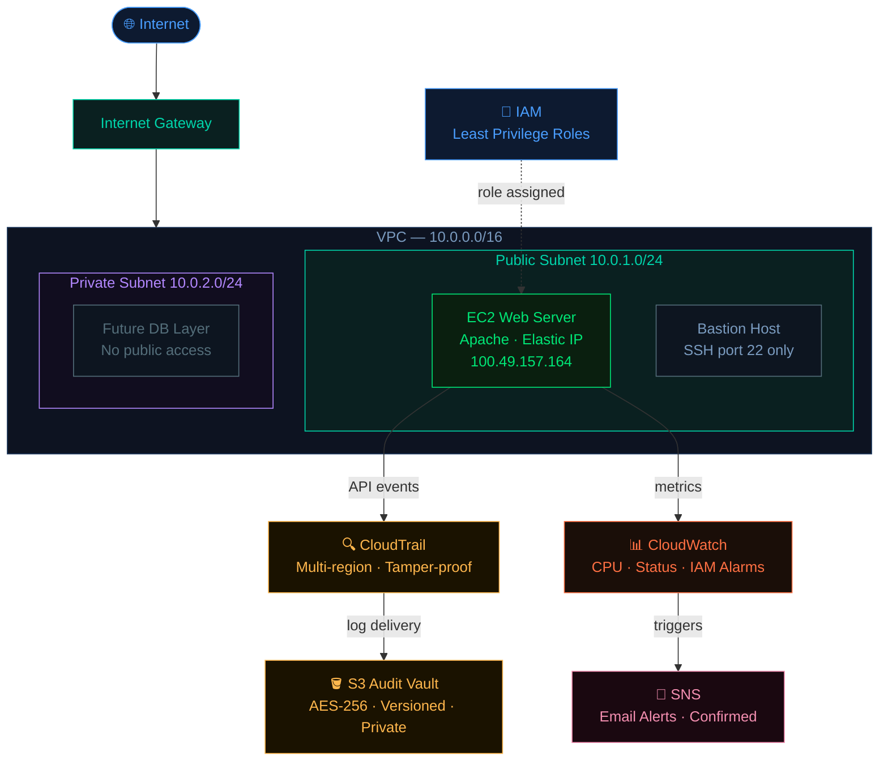

# Architecture Diagram

```mermaid
flowchart TD
    Internet([🌐 Internet]) --> IGW

    IGW[Internet Gateway] --> VPC

    subgraph VPC["VPC — 10.0.0.0/16"]
        subgraph PUB["Public Subnet 10.0.1.0/24"]
            EC2[EC2 Web Server\nApache · Elastic IP\n100.49.157.164]
            BASTION[Bastion Host\nSSH port 22 only]
        end
        subgraph PRI["Private Subnet 10.0.2.0/24"]
            DB[Future DB Layer\nNo public access]
        end
    end

    IAM[🔐 IAM\nLeast Privilege Roles] -.->|role assigned| EC2
    EC2 -->|API events| TRAIL
    TRAIL[🔍 CloudTrail\nMulti-region · Tamper-proof] -->|log delivery| S3
    S3[🪣 S3 Audit Vault\nAES-256 · Versioned · Private]
    EC2 -->|metrics| CW
    CW[📊 CloudWatch\nCPU · Status · IAM Alarms] -->|triggers| SNS
    SNS[📧 SNS\nEmail Alerts · Confirmed]

    style VPC fill:#0d1321,stroke:#1e3a5f,color:#7a9bbf
    style PUB fill:#0a2020,stroke:#00d4aa,color:#00d4aa
    style PRI fill:#110d1f,stroke:#b388ff,color:#b388ff
    style EC2 fill:#0a1f0f,stroke:#00e676,color:#00e676
    style BASTION fill:#0d1520,stroke:#546e7a,color:#7a9bbf
    style DB fill:#0d1520,stroke:#546e7a,color:#546e7a
    style IAM fill:#0d1a30,stroke:#4a9eff,color:#4a9eff
    style TRAIL fill:#1a1200,stroke:#ffb74d,color:#ffb74d
    style S3 fill:#1a1200,stroke:#ffb74d,color:#ffb74d
    style CW fill:#1a0e08,stroke:#ff7043,color:#ff7043
    style SNS fill:#1a0810,stroke:#f48fb1,color:#f48fb1
    style IGW fill:#0a2020,stroke:#00d4aa,color:#00d4aa
    style Internet fill:#0d1a30,stroke:#4a9eff,color:#4a9eff
```
